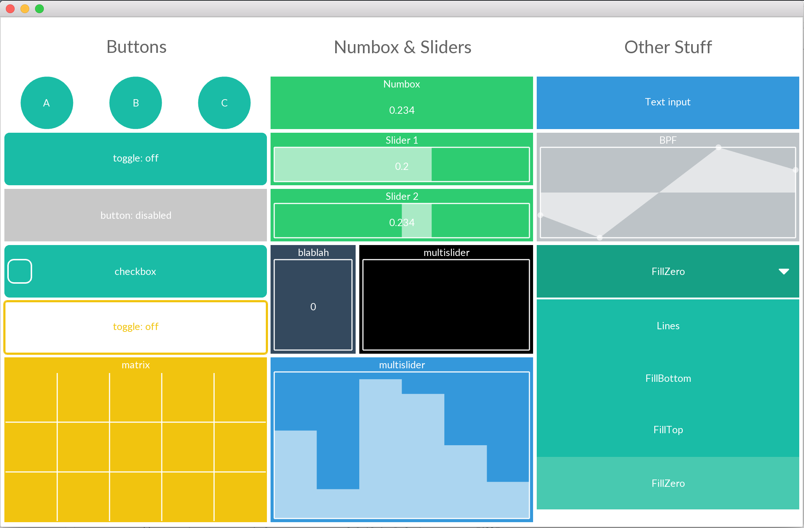

# ofxCuiCui
ofxCuiCui is a collection of GUI components for OpenFrameworks. ofxCuiCui is dynamic, easy to use, and fully customizable.

## Author
This code has been authored by <a href="http://julesfrancoise.com/" target="blank">Jules Françoise</a> during his postdoc contract at Simon Fraser University (<a href="http://movingstories.ca/" target="blank">MovingStories project</a>).

## Copyright
Copyright (C) 2016 Jules Françoise.

## Licence

This Source Code Form is subject to the terms of the Mozilla Public License, v. 2.0. If a copy of the MPL was not distributed with this file, You can obtain one at http://mozilla.org/MPL/2.0/.

## Documentation

The documentation is accessible online: http://julesfrancoise.github.io/ofxCuiCui
